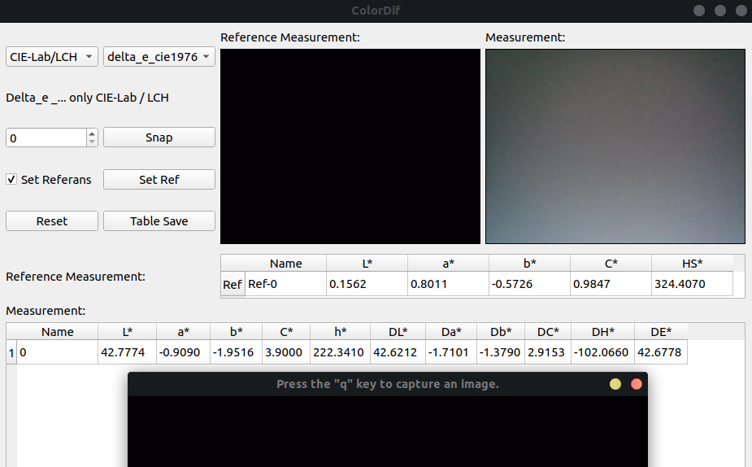
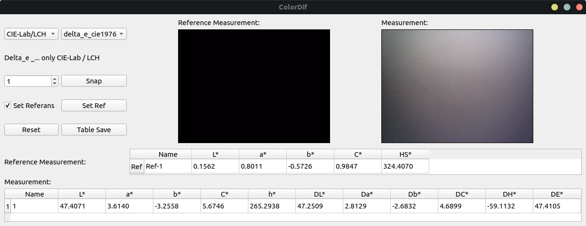
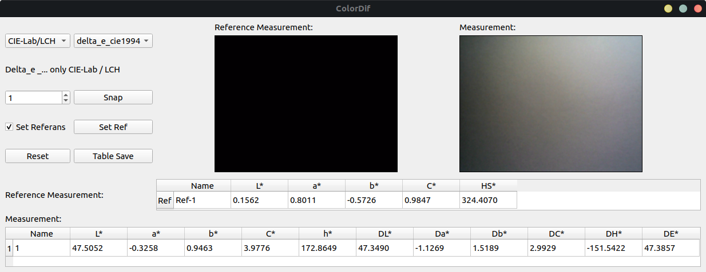
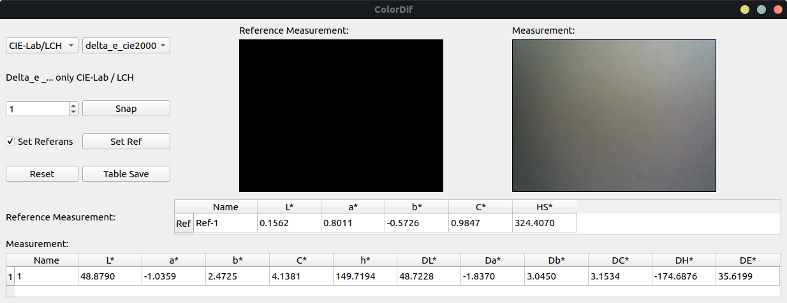
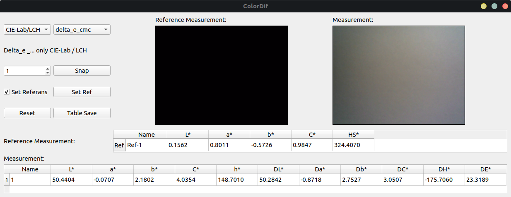
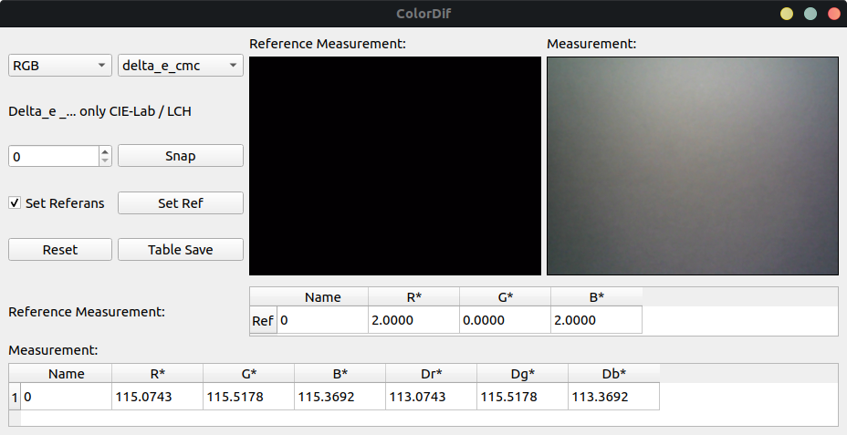
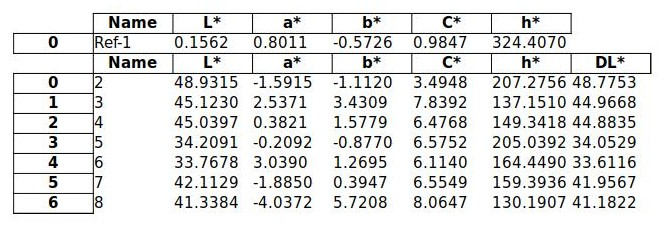

# Color_Difference_Calculator

<p align="center">
  
</p>

I took a snapshot with OpenCV. I converted the image from "Bgr" to "Rgb" with the OpenCV function. Then I converted the image into "CIELAB", "CIELCh" color space using the ```rgb2lab```, ```lab2lch``` functions of the ```skimage.color``` module.
I assigned the values of the "Reference Lab" and "Lab" to "lab reference" and "lab" with the ```LabColor``` function of the ```colormath.color.objects``` module.
 In this way, I calculated Delta_E with ```delta_e_cie1976```, ```delta_e_cie1994```, ```delta_e_cie2000```, ```delta_e_cmc``` functions of ```colormath.color_diff module```.
In "LAB", "LCH" and "RGB" calculation, I first averaged all the pixels of the images.
Then I calculated the difference by subtracting the measured value from the reference value.
I placed these operations on the interface with PyQt5.

## Testing
``` python color_difference_calculator.py ```

#### CIE-Lab-LCH
CIE-Lab-LCH Delta-E CIE76:
<p align="center">
  
</p>

CIE-Lab-LCH Delta-E CIE94:
<p align="center">
  
</p>

CIE-Lab-LCH Delta-E CIEDE2000:
<p align="center">
  
</p>

CIE-Lab-LCH CIE CMC:
<p align="center">
  
</p>

#### RGB
<p align="center">
  
</p>

## Setup Specs
> * Ubuntu 18.04
> * OpenCV 3.4.4
> * Python 3.6
> * Colormath 3.0.0
> * Scikit-image 0.16.2
> * PyQt5 5.13.2
> * Pandas 0.25.1
> * xlsxwriter 1.2.8

## Output Files
Terminal output:
```
Saved to:
/.../Color_Difference_Calculator/output.xlsx
```
<p align="center">
  
</p>
